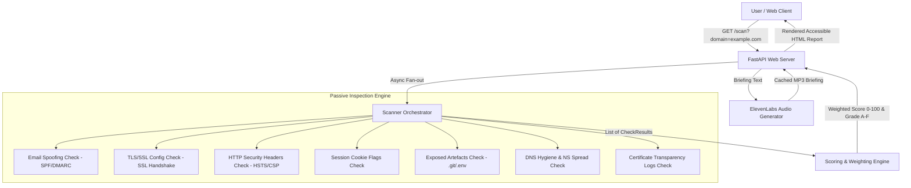

# Netgrade

**Passive security posture scanner for small businesses.**  
Enter a domain, get a scored security report across key risk checks with plain-language findings, spoken ElevenLabs audio briefings, and side-by-side competitor posture comparisons.

---

## 🏗️ Architecture & System Design

Netgrade separates the passive security inspection engine from the presentation layer using a frozen data contract (`ScanResult` JSON schema).



---

## 🔒 Scope — 7 Passive Risk Checks + Scored Report

| Check | What it Inspects | Why a Business Cares |
| :--- | :--- | :--- |
| **Email Spoofing** | SPF, DKIM, and DMARC records and policy strength | Missing DMARC means anyone can send mail as your domain. |
| **TLS Configuration** | Protocol versions, cipher strength, certificate expiry | Expired certs break trust and trigger browser red screens. |
| **Security Headers** | HSTS, CSP, X-Frame-Options, X-Content-Type-Options | Cheapest defense against a whole class of web attacks. |
| **Cookie Flags** | Secure, HttpOnly, and SameSite attributes | Weak flags expose user sessions to theft and XSS hijacking. |
| **Exposed Artefacts** | Known sensitive paths such as `.git`, `.env`, `.DS_Store` | Leaked credentials and source are a direct breach path. |
| **DNS Hygiene** | Nameserver spread, zone transfer exposure, dangling records | Single nameservers create single points of outage failure. |
| **Certificate History** | Certificate transparency logs for the domain | Reveals forgotten subdomains still exposed. |
| **Scored Report** | Weighted grade with prioritized plain-language fixes | Turns findings into an actionable decision, not a data dump. |

---

## 🚀 Quick Start — One-Command Run

### Option A: Local Run via Python
```bash
# 1. Install dependencies
pip install -r requirements.txt

# 2. Start Uvicorn development server
uvicorn netgrade.main:app --reload --port 8000
```
Open [http://localhost:8000](http://localhost:8000) in your browser.

### Option B: Docker Setup
```bash
# Build and launch single container
docker-compose up --build
```

---

## 🧪 Testing Suite

Run the full pytest unit and route integration suite:

```bash
pytest -v
```

---

## 🛡️ Threat Model & Limitations

### What this tool deliberately DOES NOT do, and why:

1. **No Active Exploitation**: Netgrade performs purely passive, read-only DNS, TLS, and HTTP inspection identical to SSL Labs and securityheaders.com. We never attempt active vulnerability exploitation or unauthorized payload injection against target hosts.
2. **No Authenticated Scanning**: Netgrade inspects public attack surfaces accessible to an external observer. It does not audit internal network posture or authenticated application endpoints.
3. **Passing Grade is Not a Clean Bill of Health**: A grade of 'A' indicates that these specific public checks passed on the scan date. It is not a guarantee against internal breaches or zero-day vulnerabilities.

---

## 👥 Team Work Split & Rubric Coverage

- **Mike (Certifa)**: Engine Lead (Checks 1-8, Async Orchestrator, Concurrency Control, Scoring Engine, Rate Limiting, Threat Model).
- **Jayden Maans**: Product Lead (Interface Design, Accessibility WCAG AA, User Flow, ElevenLabs Audio Briefing, Pytest Suite, Docker Deployment, Documentation).
