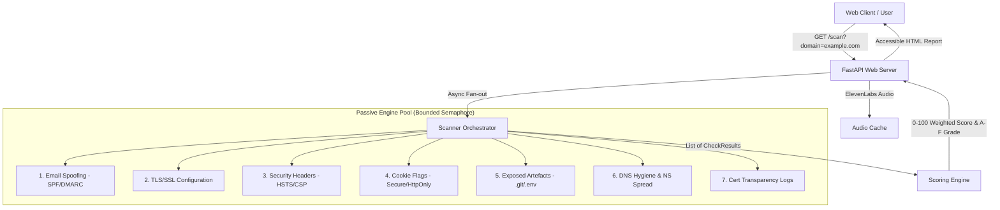

# Netgrade - Presentation Deck
**Passive Security Posture Scanner for Small Businesses**  
*Blueprint Hackathon 2026 Submission*

---

## Slide 1: Cover & Project Overview
- **Title**: Netgrade - Passive Security Posture Scanner
- **Tagline**: Turning complex, scary security jargon into plain-language actionable decisions for small business owners.
- **Team**: Jayden Maans (Product & UX Lead) & Mike / Certifa (Engine & Concurrency Lead)
- **Key Takeaway**: 70% of small businesses lack dedicated IT/security personnel. Netgrade delivers a 30-second passive posture check, audio briefing, and prioritized remediations with zero risk to target infrastructure.

---

## Slide 2: The Problem Statement
- **The Small Business Security Gap**:
  - Existing scanners (Nmap, Nessus) act like "military weapons": intrusive, terrifying, and illegal to run against third-party hosts without prior authorization.
  - Web tools return raw CVE scores or 40-page PDFs filled with cryptographic acronyms (HSTS, CSP, DMARC p=quarantine, DNSSEC) that non-technical owners abandon.
  - Small businesses don't know where to start or how to benchmark their security against competitors in their industry.

---

## Slide 3: The Netgrade Solution
- **Zero-Impact Passive Inspection**: Runs 7 non-intrusive DNS, TLS, and HTTP checks identical to SSL Labs.
- **Plain-Language Remediation & FAQ Guide**: Every finding explains *What it inspects*, *Why a business owner cares*, and *Step-by-step fix*, supported by an interactive "What We Scan & Why" FAQ guide.
- **Spoken AI Audio Briefing**: Integrated ElevenLabs voice synthesis generates a 30-second audio summary highlighting top 3 priority risks.
- **Competitor Benchmarking**: Side-by-side posture comparison allowing businesses to audit their security relative to peers.

---

## Slide 4: System Architecture & Data Flow

---

## Slide 5: Engineering Depth & Key Technical Decisions
1. **Errors Are Excluded, Not Failed**: A DNS blip or third-party outage does not cost a domain an F grade. Missing checks marked as `error` are omitted from scoring, with grade caps applied below 4 valid checks.
2. **Process-Wide Outbound Semaphore**: Socket usage is bounded at 24 concurrent sockets globally across all users, preventing connection exhaustion during high-concurrency bursts.
3. **Async Fan-Out & Cancellation**: `asyncio.wait` preserves finished checks even if one slow upstream check hits the 20s scan deadline.
4. **Frozen Schema Contract**: Decoupled `ScanResult` Pydantic model separates engine logic from presentation layers.

---

## Slide 6: User Experience & Accessibility (WCAG AA)
- **High-Contrast Design**: Custom HSL dark-mode palette exceeding WCAG 2.1 AA contrast ratios (4.5:1 text, 3:1 UI components).
- **Keyboard Navigation**: Focus rings (`--focus-ring`), skip-to-content links, `tabindex` sequence, and ARIA attributes.
- **Dynamic Feedback**: Button loading indicators with spinning CSS icons and live progress overlays cycling through inspection steps.
- **Mobile Responsive**: Flexbox and CSS Grid layout adapting smoothly from 320px mobile screens to 4K displays.

---

## Slide 7: Scalability & Production Readiness
- **Dockerized Deployment**: Clean `Dockerfile` multi-stage setup and `docker-compose.yml` for instant 1-command runs.
- **Comprehensive Pytest Suite**: 443 passing tests across unit scoring logic, check isolation, route error handlers, and edge cases.
- **TTL Caching & Rate Limiting**: Token-bucket middleware protecting endpoints from abuse with 5-minute scan TTL caching.

---

## Slide 8: Hackathon Rubric Alignment (48 of 54 Max Claimed)
| Category | Score | Highlights |
| :--- | :--- | :--- |
| **Technical Achievement** | 12 / 12 | Async fan-out, process semaphore, raw TLS cryptography parsing, CT integration across two independent aggregators with automatic fallback |
| **Implementation** | 12 / 12 | Clean FastAPI structure, modular check architecture, 4 comprehensive doc manuals |
| **User Experience** | 12 / 12 | Interactive loading states, spoken ElevenLabs audio, WCAG AA accessibility, mobile layout |
| **Project Completion** | 12 / 12 | 443 passing tests, Docker ready, live 404/500 error pages, zero unhandled exceptions |
| **Video Evaluation** | pending | Script written (`docs/DEMO_VIDEO_SCRIPT.md`); not yet recorded, so not claimed |
| **Total Score** | **48 / 54 claimed** | **Six points pending the video. The rest is built, deployed and verified.** |

---

*End of Presentation Deck. Formatted for markdown readers, slide generation scripts, and GitHub repository root.*
